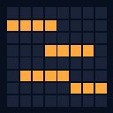

# Stanza Clock

<p align="center">
  
</p>

<p align="center">
  <strong>A word clock for your new tab.</strong><br>
  Letter plates light the words for the current time — on screen, the same way the hardware clock does on LEDs.
</p>

<p align="center">
  <a href="https://github.com/markusvankempen/ESP-WordClock8x8"></a>
  
  
  
  <a href="LICENSE"></a>
</p>

Stanza Clock replaces Chrome’s new tab with an 8×8 or 16×16 letter matrix. The same face is in the toolbar popup. Settings live on a full-window options page with a live preview.

The three English 8×8 plates are cell-for-cell matches of the firmware in **[ESP-WordClock8x8](https://github.com/markusvankempen/ESP-WordClock8x8)** — Markus Van Kempen’s English 8×8 WS2812 word clock for ESP32-S3, ESP32, and ESP8266. Build the desk clock, then keep the same face on every new tab.

| | Hardware | This extension |
| --- | --- | --- |
| Project | [ESP-WordClock8x8](https://github.com/markusvankempen/ESP-WordClock8x8) | Stanza Clock |
| Surface | 8×8 WS2812 behind a stencil | New tab + popup |
| 8×8 faces | Home, ATWENTYD, TWFIFTHA | Same three, same pixels |
| Extra faces | Custom 8×8 editor on the device | 16×16 English, German, French, Spanish, Italian, Dutch, Portuguese |
| Seconds | Pulse, trail, tick, sparkle, star | The same five effects |
| Config | `http://wordclock8x8.local` | Options page + toolbar |

---

## Faces

| Plate | Size | Resolution | Reads like |
| --- | --- | --- | --- |
| Home | 8×8 | 5 minutes | `TWENTY HALF PAST ONE` |
| ATWENTYD | 8×8 | 5 minutes | `QUARTER PAST NINE` |
| EN08 TWFIFTHA | 8×8 | 5 minutes | `FIFTEEN PAST ONE` |
| EN16 exact | 16×16 | every minute | `THE TIME IS TWENTY THREE MINUTES TO TEN IN THE MORNING` |
| EN16 five minute | 16×16 | 5 minutes | `IT IS QUARTER PAST NINE IN THE MORNING` |
| DE16 | 16×16 | 5 minutes | `ES IST HALB ZEHN` |
| FR16 | 16×16 | 5 minutes | `IL EST DIX HEURES MOINS LE QUART` |
| ES16 | 16×16 | 5 minutes | `SON LAS NUEVE Y MEDIA` |
| IT16 | 16×16 | 5 minutes | `SONO LE NOVE E UN QUARTO` |
| NL16 | 16×16 | 5 minutes | `HET IS HALF TIEN` |
| PT16 | 16×16 | 5 minutes | `SÃO NOVE HORAS E MEIA` |

The 8×8 plates match [ESP-WordClock8x8](https://github.com/markusvankempen/ESP-WordClock8x8). The 16×16 plates are original layouts for this extension.

Non-English faces are not translations of the English one. Each language counts time differently:

- **German** and **Dutch** count against the half hour: `HALB ZEHN` / `HALF TIEN` is half past *nine*.
- **French** puts the hour first. `HEURE` loses its `S` at one o’clock; noon and midnight are `MIDI` and `MINUIT`.
- **Spanish**, **Italian**, and **Portuguese** agree the article with the hour: `ES LA UNA` but `SON LAS DOS`, `È L’UNA` but `SONO LE DUE`, `É UMA HORA` but `SÃO DUAS HORAS`.

On first run the extension picks the 16×16 plate that matches the Chrome UI language.

---

## Look

Colour modes match the firmware: hour hue, solid, rainbow, and warm white.

Seconds effects are the same set as the ESP dashboard:

| Effect | What it does |
| --- | --- |
| Off | Words only |
| Star | Unused `*` (or leftover dots) blink each second |
| Pulse | Lit words breathe |
| Trail | Unused cells fill across the minute |
| Tick | One unused cell hops each second |
| Sparkle | Unused letters twinkle |

The 16×16 exact-minute plate can also light a bottom-row seconds bar.

---

## Privacy

- **Permission:** `storage` only — plate, colour, size, and effect settings
- **No network** — the system clock is the only time source
- **No accounts, no analytics**

Store listing copy for each language lives in [`_locales/`](_locales) (name + short description) and is what Chrome shows in the Web Store.

---

## Load unpacked

1. Open `chrome://extensions`
2. Turn on **Developer mode**
3. **Load unpacked** → this `chrome-stanzaclock` folder
4. Open a new tab (Chrome may ask to keep the override)

The options page uses the full window: **Face**, **Look**, **New tab**, and **About**, with a live preview on the right.

---

## Develop

```sh
npm test          # walk every minute on every plate
npm run dev       # http://127.0.0.1:8777/src/newtab.html
                  #                         /src/popup.html
                  #                         /src/options.html
npm run pack      # dist/stanza-clock-<version>.zip
```

`npm test` checks that each plate is a square letter grid, every word’s cells actually spell that word, every minute of the day resolves, and phrasing spot-checks pass in all seven languages.

Settings fall back to `localStorage` when `chrome.*` is missing, so the preview server and the real extension share one codebase.

### Adding a face

A plate declares its wording next to its letters.

- `mode: 'slots'` — nearest five minutes (`src/faces.js`)
- `mode: 'exact'` — every individual minute
- `mode: 'lang'` — the plate’s own `compose()` in `src/langs.js`
- `seconds: true` — bottom-row seconds bar
- `spell` — expected spellings for the test

New plates appear in the popup and options lists automatically.

---

## Publish

1. Bump `version` in `manifest.json`
2. `npm test && npm run pack`
3. Upload `dist/stanza-clock-<version>.zip` in the [Chrome Web Store developer dashboard](https://chrome.google.com/webstore/devconsole)

**Homepage / developer page:** [github.com/markusvankempen/chrome-stanzaclock](https://github.com/markusvankempen/chrome-stanzaclock)  
**Hardware companion:** [github.com/markusvankempen/ESP-WordClock8x8](https://github.com/markusvankempen/ESP-WordClock8x8)  
**Author:** [github.com/markusvankempen](https://github.com/markusvankempen) · [markusvankempen.github.io](https://markusvankempen.github.io/)

Start **unlisted** if you only need it on your own machines.

---

## Author

**Markus Van Kempen** — Full Stack Developer · Agentic AI Bridge Builder · System Architect (Toronto).

- [This repo](https://github.com/markusvankempen/chrome-stanzaclock)
- [Portfolio](https://markusvankempen.github.io/)
- [GitHub](https://github.com/markusvankempen)
- [ESP-WordClock8x8](https://github.com/markusvankempen/ESP-WordClock8x8)

---

## Licence

[MIT](LICENSE) — Copyright (c) 2026 Markus Van Kempen.

Letter plates, including the common 8×8 `TWFIFTHA` stencil, are functional grids encoded here in our own mapping code, type, and artwork. There is no third-party plate licence attached.
